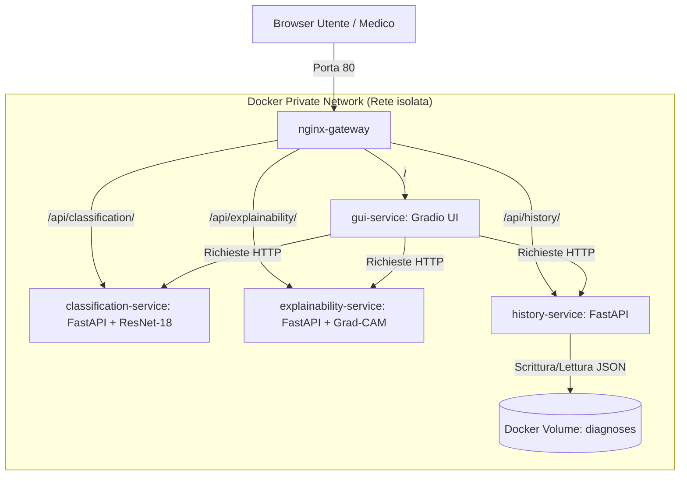

# Strumento Diagnostica Tumori Cerebrali: Refactoring Cloud-Native

**Sviluppato da Giacomo Liguori**

Il progetto introduce la transizione da un prototipo monolitico sequenziale a un'architettura distribuita cloud-native orientata ai micro servizi, containerizzata con **Docker** e isolata tramite reverse proxy con **Nginx**

## 1. Transizione Architetturale

**Architettura Iniziale (Monolito)**

Il sistema originario era strutturato come unico script sequenziale scritto in **Python**. Tutte le responsabilità erano accoppiate all'interno dello stesso runtime:

* Caricamento in memoria della rete neurale convoluzionale **ResNet-18**.

* Calcolo matematico dei gradienti per la mappa di calore con architettura **Grad-CAM**.

* Gestione di stato dell'interfaccia utente con libreria **Gradio** e della logica di esecuzione.

Questo approccio presentava forti limiti in termini di:

* **Scalabilità**, il pesante calcolo della mappa di calore bloccava l'intero thread della GUI.

* **Manutenibilità**, qualsiasi modifica al modello comprometteva la GUI.

* **Tolleranza ai guasti**, un crash del modello comportava il blocco totale dell'applicazione.

**Architettura Finale (Micro servizi Distribuiti)**

Il sistema è stato scomposto in 4 micro servizi e 1 reverse proxy, isolando i contesti computazionali e di business in container dedicati:

1.  `nginx-gateway`: Unico punto di accesso del sistema sulla porta standard **80**. Svolge il ruolo di **API Gateway** e smista il traffico. Dipende dai seguenti 4 servizi.

2.  `gui-service`: Client leggero basato su libreria **Gradio** che si occupa esclusivamente dell'interfaccia utente e dell'interazione con il radiologo. Dipende dai seguenti 3 servizi.

3.  `classification-service`: Micro servizio indipendente dedicato al caricamento del modello **ResNet-18** e all'inferenza pura su referti da risonanza magnetica.

4.  `explainability-service`: Micro servizio indipendente dedicato all'estrazione delle feature map e generazione della mappa di calore, avvalendosi di strutture dati e operazioni fornite dalla libreria **PyTorch**.

5.  `history-service`: Micro servizio indipendente per lo storage stateless delle metriche di diagnosi, serializzate e deserializzate in formato **JSON**.

`classification-service`, `explainability-service` e `history-service` operano in modalità asincrona, per mezzo della libreria **FastAPI**.

## 2. Diagramma Architetturale

## 3. Scelte Progettuali e Pattern Adottati

* **Single Responsibility Principle:** Ciascun container svolge un solo incarico. Il calcolo della mappa di calore richiedere l'elaborazione dei gradienti (molto dispendiosa in termini di memoria), mentre la classificazione è stateless ed esente dai gradienti. Isolare i due contesti ottimizza l'allocazione delle risorse CPU.

* **API Gateway Pattern:** Centralizzando i flussi di rete su **Nginx**, l'architettura interna dei microservizi viene nascosta. Questo permette di aggiornare gli URL, scalare i container o cambiare le porte interne senza dover aggiornare il codice del client o esporre porte vulnerabili dell'host.

* **Strangler Pattern:** Il refactoring segue una logica transizionale, estraendo gradualmente le funzioni computazionali dal monolito originario per avvolgerle in endpoind **REST** protetti.

* **Stateless Persistence** via **Docker Volumes**: Per azzerare l'overhead di configurazione di un **DBMS** relazionale, la persistenza è gestita tramite file **JSON** strutturati, il quale non richiede parsing sintattico rispetto al **CSV**. La consistenza e la persistenza reale dei dati oltre il ciclo di vita dei container sono garantite dal montaggio di un **Docker Volume** logico denominato `diagnoses`.

## 4. Modalità di Deployment

L'intera infrastruttura è automatizzata e riproducibile grazie a **Docker** e Docker **Compose**

**Requisiti**:

* Docker **Desktop** installato e attivo.

**Istruzioni di avvio**:

Dalla cartella radice del progetto, eseguire il comando di build e orchestrazione:

`docker compose up --build`

Questo comando attiva la seguente pipeline automatizzata:

1. Compilazione dei **Dockerfile** dedicati, basati su immagine leggera e sicura di **Python** (python:3.13-slim).

2. Installazione isolata delle dipendenze.

3. Creazione della rete virtuale inter-container.

4. Inizializzazione del volume logico per il file `history.json`.

5. Avvio del reverse proxy **Nginx** sulla porta globale **80**.

## 5. Strategie di Testing e Validazione

La validazione dell'architettura distribuita è stata condotta su tre livelli di dettaglio.

1. **Unit Testing** dei singoli **Endpoint** (Swagger UI / OpenAPI): Sfruttando la documentazione nativa generata da **FastAPI**, ogni singolo microservizio è stato testato in isolamento accedendo alle interfacce aperte sulla risorsa interna `/docs` *(porte 8001, 8002, 8003 in fase di sviluppo locale)*, per convalidarne la struttura dei payload **JSON** e codici di stato **HTTP**.

2. **Integration Testing** di **Rete** (API Gateway Routing): Verifica del corretto instradamento e del path trimming operato da **Nginx** tramite chiamate programmatiche *(es. inoltro manuale di una richiesta GET verso http://localhost/api/history/logs)*.

3. **Functional Testing**: Simulazione del workflow clinico reale tramite l'interfaccia utente di **Gradio**.

## 6. Benefici Ottenuti dall'Evoluzione Proposta

* **Manutenibilità** ed **Evolutività** Elevate: Qualora necessario aggiornare il modello **ResNet-18** di Deep Learning, l'intervento richiederà la sola modifica del `classification-service`, senza alcun impatto sulla GUI o modulo di spiegabilità.

* **Tolleranza ai Guasti**: Qualora il servizio **Grad-CAM** riscontra un crash a causa di saturazione della memoria durante il calcolo dei gradienti, il microservizio di classificazione principale continuerà a erogare le diagnosi testuali. L'interfaccia utente gestisce le eccezioni di rete in modo controllato, preservando il flusso dell'esperienza utente.

* **Scalabilità Selettiva**: In contesti di elevato traffico ospedaliero, l'amministratore dell'infrastruttura può scalare orizzontalmente il solo container di classificazione tramite il comando `docker compose up --scale classification-service=3`, ottimizzando l'hardware a disposizione in base ai reali colli di bottiglia del sistema.

## Warning For External Users
This tool was developed for educational purposes, as a project for the university course of software evolution. The diagnoses generated are not clinically accurate for all inputs.
